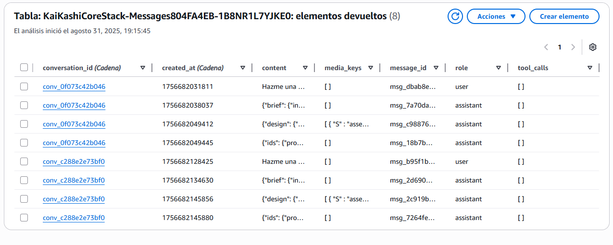
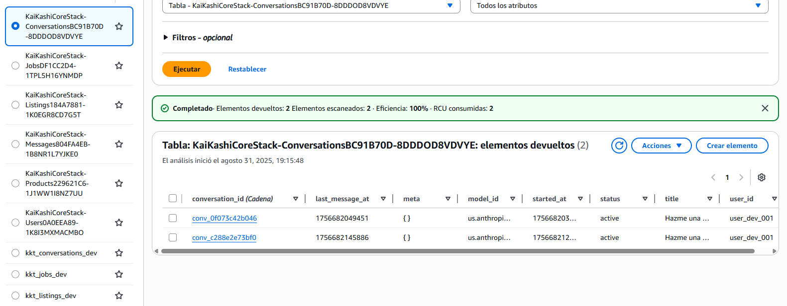
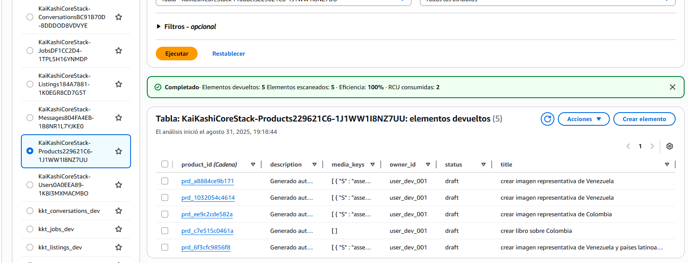
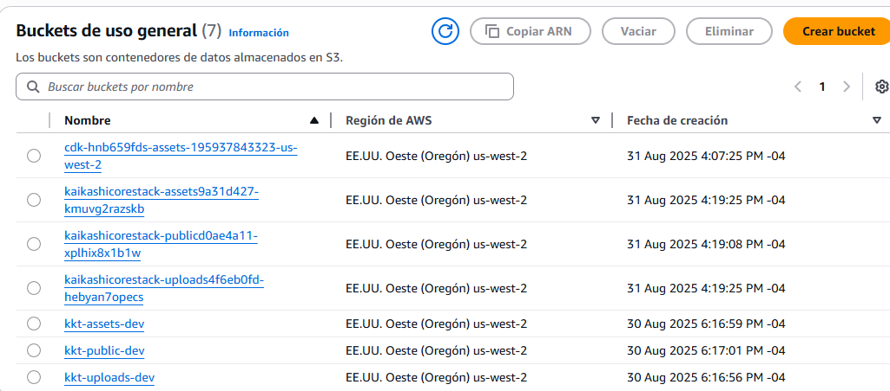
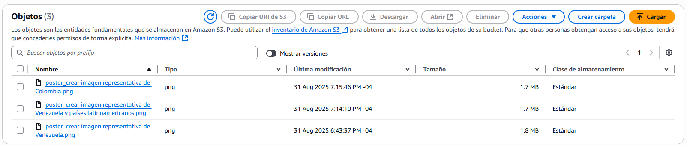
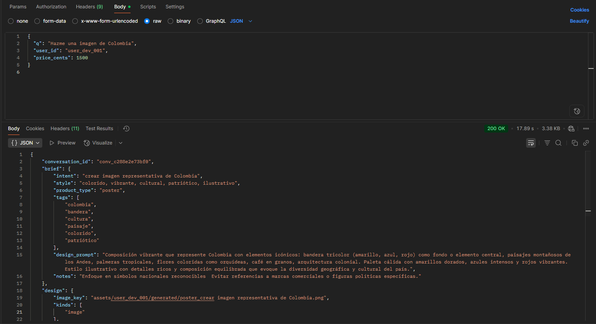
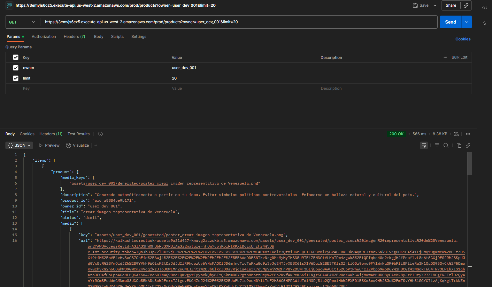

# KaiKashi Tech — DreamForge (Backend Starter)
Local-first starter with FastAPI + Strands Agents + AWS SDK (boto3). Production deploy via AWS CDK (Python).

## Quickstart (Local)
1) Python 3.10+
2) `python -m venv .venv && source .venv/bin/activate` (Windows: `.venv\Scripts\activate`)
3) `pip install -r requirements.txt`
4) Copy `.env.example` to `.env` and set values.
5) Run API: `uvicorn api.main:app --reload --port 9000`

## Layout
- `api/` FastAPI local API for testing pipeline.
- `agents/` Strands Agents factory + pipelines (interpret → design → listing).
- `lambdas/` Lambda handlers for Step Functions (production).
- `shared/` Reusable AWS utilities (S3, DynamoDB, config, cache).
- `infra/` AWS CDK app + IAM policies + (Optionally) Step Functions definition.

## Notes
- Uses Strands Agents (`strands`) as LLM orchestrator over Bedrock.
- Multimodal: text, images, pdf, audio. Audio can be transcribed with Amazon Transcribe.
- Image generation stubbed via Bedrock Titan Image (if enabled in your region/account).
- Caching: Strands cache + DynamoDB content-addressable cache (SHA256 of prompt bundle).

# Products
aws dynamodb create-table `
  --table-name kkt_products_dev `
  --attribute-definitions AttributeName=product_id,AttributeType=S `
  --key-schema AttributeName=product_id,KeyType=HASH `
  --billing-mode PAY_PER_REQUEST `
  --region us-west-2

# Listings
aws dynamodb create-table `
  --table-name kkt_listings_dev `
  --attribute-definitions AttributeName=listing_id,AttributeType=S `
  --key-schema AttributeName=listing_id,KeyType=HASH `
  --billing-mode PAY_PER_REQUEST `
  --region us-west-2

# Users
aws dynamodb create-table `
  --table-name kkt_users_dev `
  --attribute-definitions AttributeName=user_id,AttributeType=S `
  --key-schema AttributeName=user_id,KeyType=HASH `
  --billing-mode PAY_PER_REQUEST `
  --region us-west-2

# Jobs
aws dynamodb create-table `
  --table-name kkt_jobs_dev `
  --attribute-definitions AttributeName=job_id,AttributeType=S `
  --key-schema AttributeName=job_id,KeyType=HASH `
  --billing-mode PAY_PER_REQUEST `
  --region us-west-2

aws dynamodb create-table `
  --table-name kkt_messages_dev `
  --attribute-definitions AttributeName=job_id,AttributeType=S `
  --key-schema AttributeName=job_id,KeyType=HASH `
  --billing-mode PAY_PER_REQUEST `
  --region us-west-2

  aws dynamodb create-table `
  --table-name kkt_conversations_dev `
  --attribute-definitions AttributeName=job_id,AttributeType=S `
  --key-schema AttributeName=job_id,KeyType=HASH `
  --billing-mode PAY_PER_REQUEST `
  --region us-west-2

## S3, DynamoDB, Lambda

## Imagen Generada

## Postman

